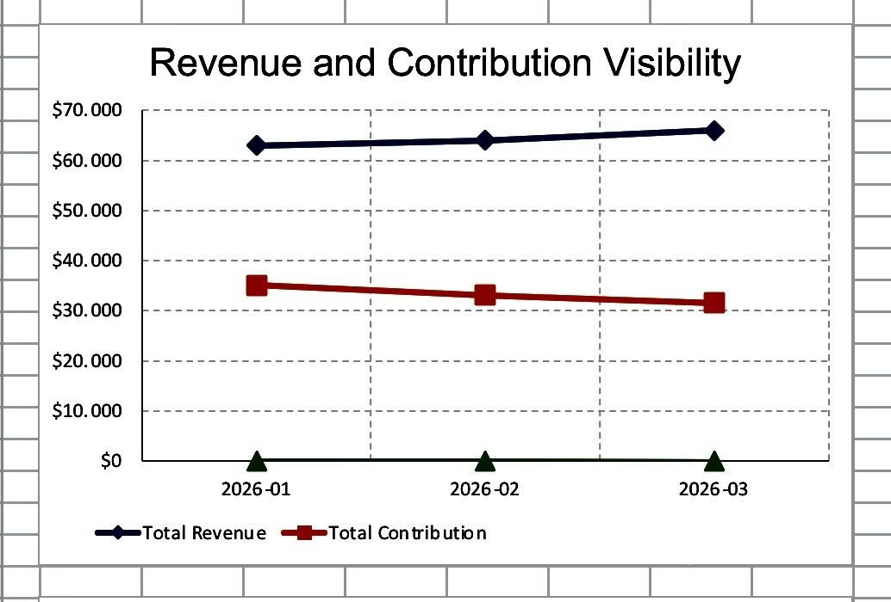
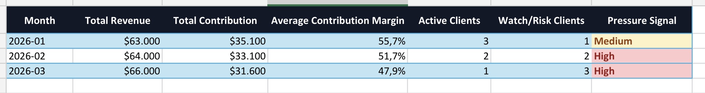
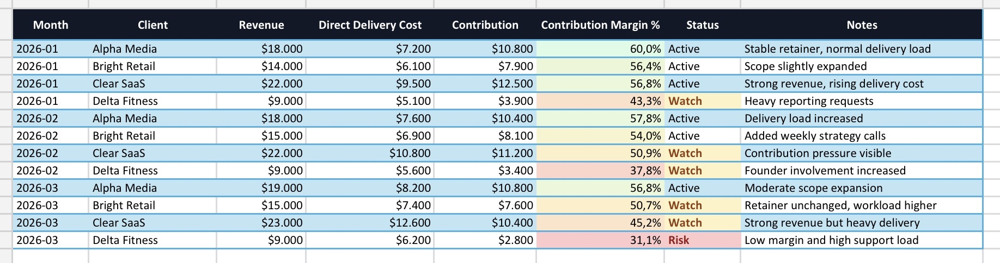
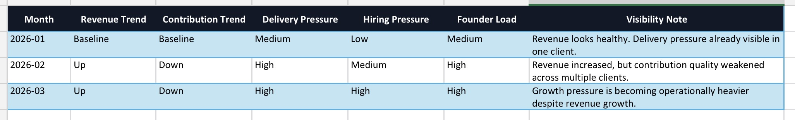

# Agency Growth Control

Open operational decision framework for founder-led agencies to monitor contribution, growth pressure, and monthly decision signals.

---

## Overview

Most agencies monitor revenue growth.

Far fewer monitor operational contribution quality.

As agencies scale, operational pressure often appears before financial instability becomes visible.

Client delivery expands.
Hiring pressure increases.
Margins compress gradually.
Decision-making becomes reactive.

But revenue can still appear healthy.

This framework explores how founder-led agencies can improve operational visibility through structured monthly review systems and contribution-oriented decision logic.

---

## Framework Flow

```text
Client Data
   ↓
Contribution Visibility
   ↓
Operational Pressure Signals
   ↓
Monthly Review
   ↓
Founder Decision Clarity

```

This repository focuses only on the public visibility layer.

It does not represent the full internal Growth Ops Control System.

---

## Core Focus Areas

- contribution visibility
- operational pressure detection
- monthly review cadence
- client-level structural visibility
- growth pressure monitoring
- founder decision clarity

---

## Why This Exists

Many operational issues inside agencies emerge gradually:

- expanding delivery scope
- unchanged retainers
- reactive hiring
- contribution compression
- client concentration risk
- increasing founder involvement

These shifts are often difficult to detect early when visibility depends only on revenue metrics.

This project explores a more operationally-aware review framework.

---

## Repository Structure

```text
docs/
  contribution-logic.md
  monthly-review.md
```

Additional framework components will be added progressively.

---

## Framework Philosophy

The goal is not maximizing growth speed.

The goal is maintaining operational clarity while scaling.

Growth without visibility creates structural pressure.

Operational visibility improves decision quality.

---

## Current Status

Early open framework documentation.

This repository is being expanded incrementally.

---

## Planned Areas

- operational review templates
- contribution tracking examples
- sample operational dashboards
- structured review workflows

---

## Scope Note

This is a public Lite framework.

It is designed to show a simple contribution-oriented visibility example for founder-led agencies.

It does not include proprietary decision logic, freeze rules, advisory delivery logic, or the full internal Growth Ops Control System.

---

## License

MIT License

## Framework Screenshots

### Monthly Visibility Summary


### Revenue and Contribution Trend


### Client Contribution View


### Operational Pressure View

